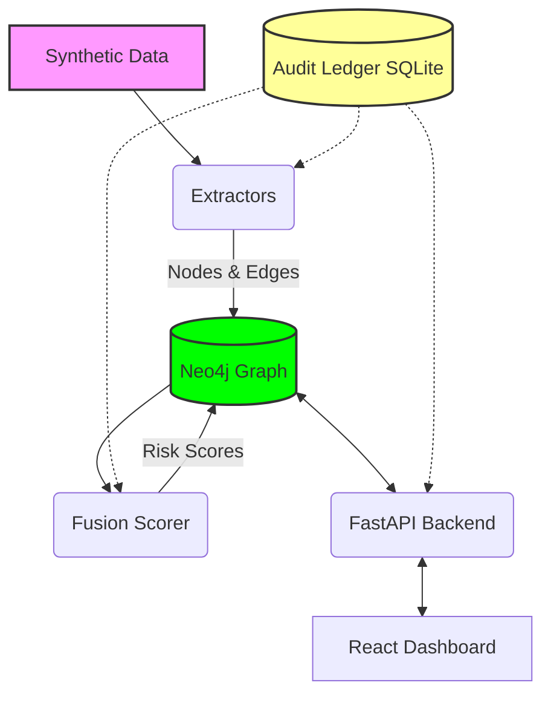

# Criminal Network Analysis System — SIH Prototype

## Overview
This project is a multi-source data fusion prototype designed to detect hidden criminal network connections. It demonstrates its capabilities through a narcotics trafficking ring scenario, fusing disparate data streams (telecom, financial, police records, colocation) into a graph database and evaluating risk signals.

## Architecture



The Audit Ledger operates as a cross-cutting concern to guarantee chain of custody and data provenance for all extracted information and analyst decisions.

## Prerequisites
- Python 3.11+
- Node.js 18+
- Docker (for Neo4j)

## Quick Start

1. **Start Neo4j:**
```bash
docker run -d --name neo4j-criminal-network \
  -p 7474:7474 -p 7687:7687 \
  -e NEO4J_AUTH=neo4j/password123 \
  -e NEO4J_PLUGINS='["graph-data-science"]' \
  neo4j:5-community
```

2. **Install Python dependencies:**
```bash
pip install -r backend/requirements.txt
```

3. **Generate synthetic data & run pipeline:**
```bash
python scripts/generate_synthetic_data.py
python scripts/load_data.py
python -c "from backend.entity_resolution import EntityResolver; from backend.neo4j_client import Neo4jClient; from backend.ledger import AuditLedger; r = EntityResolver(Neo4jClient(), AuditLedger()); print(r.resolve())"
python -c "from backend.extractors.cdr_extractor import CDRExtractor; from backend.neo4j_client import Neo4jClient; from backend.ledger import AuditLedger; e = CDRExtractor(Neo4jClient(), AuditLedger()); print(e.extract())"
python -c "from backend.extractors.financial_extractor import FinancialExtractor; from backend.neo4j_client import Neo4jClient; from backend.ledger import AuditLedger; e = FinancialExtractor(Neo4jClient(), AuditLedger()); print(e.extract())"
python -c "from backend.extractors.colocation_extractor import ColocationExtractor; from backend.neo4j_client import Neo4jClient; from backend.ledger import AuditLedger; e = ColocationExtractor(Neo4jClient(), AuditLedger()); print(e.extract())"
python -c "from backend.extractors.case_extractor import CaseExtractor; from backend.neo4j_client import Neo4jClient; from backend.ledger import AuditLedger; e = CaseExtractor(Neo4jClient(), AuditLedger()); print(e.extract())"
python -c "from backend.fusion import FusionScorer; from backend.neo4j_client import Neo4jClient; from backend.ledger import AuditLedger; f = FusionScorer(Neo4jClient(), AuditLedger()); print(f.run())"
```
Or simply:
```bash
python scripts/run_pipeline.py
```

4. **Start backend:**
```bash
uvicorn backend.main:app --reload --port 8000
```

5. **Start frontend:**
```bash
cd frontend
npm install
npm run dev
```

## Demo Script

Follow these steps to demonstrate the full capabilities of the system:

1. **Show full graph** — It initially looks like a normal social or communications network.
2. **Open Potential Risk queue** — Highlight a financier-courier pair with zero direct calls but flagged by the system due to a high risk score.
3. **Click into evidence breakdown** — Show 2 co-location events + 1 financial transaction that individually mean nothing but fused together crossed the threshold.
4. **Confirm the flag** — A new edge is formed in the graph, and a new unalterable ledger block is recorded.
5. **Root-cause traversal** — From a seized-drugs FIR, walk backward through the graph to the earliest connected event.
6. **Centrality** — Demonstrate that the financier scores high on betweenness centrality despite having a low overall degree, emphasizing their hidden role as a bridge.
7. **Ledger verify** — Verify the cryptographic chain. Then maliciously tamper with a ledger record in the SQLite database and re-verify to show failure and the resulting alert.

## Tech Stack

| Component | Technology | Description |
|-----------|------------|-------------|
| **Database** | Neo4j | Graph database for network topology and GDS analysis |
| **Audit Ledger** | SQLite | Immutable cryptographic ledger tracking data provenance |
| **Backend** | Python / FastAPI | High-performance API routing and data orchestration |
| **Frontend** | React / Cytoscape.js | Interactive UI and complex graph visualization |
| **Graph Compute**| Neo4j GDS | Advanced algorithms (PageRank, Louvain, Centrality) |

## API Reference

| Method | Path | Description |
|--------|------|-------------|
| `GET` | `/graph` | Returns full graph for UI, optional `node_id` query for 2-hop neighborhood. |
| `GET` | `/nodes/{node_id}` | Node details + timeline of evidence involving the node. |
| `GET` | `/nodes/{node_id}/centrality` | Returns centrality scores (PageRank, Betweenness). |
| `GET` | `/risk-queue` | Potential risk edges with score sorting. |
| `POST` | `/risk-queue/{edge_id}/confirm` | Confirm risk (updates edge, writes to ledger). |
| `POST` | `/risk-queue/{edge_id}/dismiss` | Dismiss risk (updates edge, writes to ledger). |
| `GET` | `/communities` | Louvain community detection groups. |
| `GET` | `/root-cause/{event_id}` | Backward traversal path from a specific event/FIR. |
| `GET` | `/ledger` | Paginated blocks from the immutable audit ledger. |
| `GET` | `/ledger/verify` | Validates hash chain integrity. |
| `GET` | `/stats` | Macro statistics for the dashboard. |

## Future Work

- **Real OCR / Scanned Document Pipeline**: Extend extractors to support raw unstructured image/PDF data.
- **Multilingual / Cross-script Entity Resolution**: Expand RapidFuzz capabilities to cross-reference multiple dialects and scripts seamlessly.
- **Live LLM Natural-Language-to-Cypher**: Let analysts query the graph directly via AI chat instead of structured UI only.
- **Bayesian Log-Odds Calibration**: Replace heuristic weights with rigorously calibrated probabilities.
- **RBAC System**: Fully implement Role-Based Access Control for evidence handling.
- **Message Queue**: Implement Kafka/RabbitMQ for scaling ingestion pipelines horizontally.
